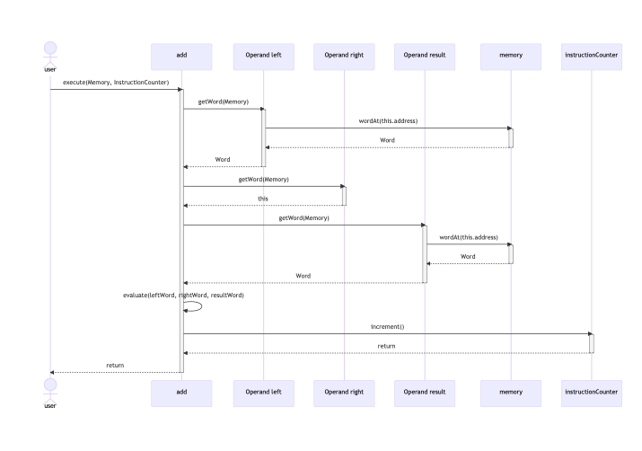
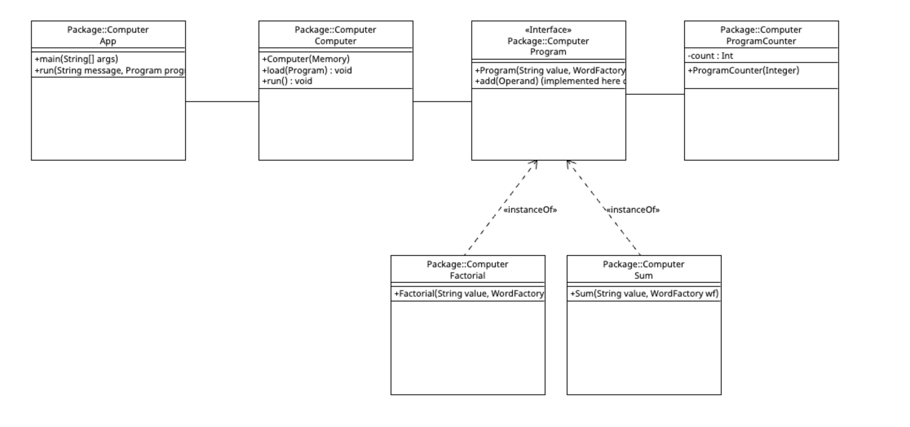

# EDAF60 2023 Computer Group 46

This project modeles a simple computer, with internal memory and the power to execute the seven basic commands. The computer can run programs and du calculations over different datatypes.

This project implements the following patterns:
- _Command patter_ as the entire structure is modeled as a computer executing commands.
- _Factory pattern_ when creating content for the computer's memory.
- _Templete method_ with inheritance, especially of the word class.

## Hey Group 46!

__Group Members__
- Henrik Vester
- Viktor Pekkari
- Gustaf Jonson
- Joel Bengs

Here are some useful resources on design patterns. To start with, [Fireship's](https://www.youtube.com/watch?v=tv-_1er1mWI) videos are always fire. [Refactoring](https://refactoring.guru/design-patterns) is another hidden gem worth checking out.

## Sequence Diagram - Add
Below is a sequence diagram for executing the Add instruction.



This corresponds to the execution of the following code, ineherited from the BinOp class, which Add extends.
```java
public void execute(Memory memory, InstructionCounter instructionCounter) {
        var wordLeft = left.getWord(memory);
        var wordRight = right.getWord(memory);
        var wordResult = result.getWord(memory);
        evaluate(wordLeft, wordRight, wordResult);
        instructionCounter.increment();
    }
```

## Design questions

### Dealing with operands

#### O1: The Factorial-program

When defining the factorial program, the computer's memory is not yet instantiated. The computer's memory only turns up when the computer itself is instantiated.

The word `n` and `fac` should be kept in the computer's memory. The `Address` objects are simply there to facilitate referencing the not-yet instantiated computer memory. When the program is loaded into the computer, these addresses are translated to actual memory addresses.

#### O2: What information do we need to fetch the word at a given address?

The only information required to fetch the word at a given address is where in memory it is located, which is given to the `Address` constructor.

#### O3: What type of arguments do we provide when we create an Add object? What types can we have in the general case?

_Note: This question referes to the instructor Add, which takes three operands. Not the method add of the interface Program, which adds consecutive steps to the program itself._

Two addresses (or just as well values) referencing the operands, and one address for where to store the result.

The types that can be passed into the `Add` constructor are either addresses, given by `Address` objects, or values, given as `String`s passed into the `WordFactory` to create `Word`s.

#### O4: How do we model the answer of O3? Draw a class diagram which shows how these classes/interfaces relate to each other

Class diagram for `Add`:


#### O5: What does the Add class want to do with these operands? Update the class diagram from O4

Updated class diagram for `Add`:


An `Add` object is constructed by passing into it two `Operand` objects (either an `Address` or `Word`), which will constitute the left and right operands  of the instruction ('arguments'), and one `Address`, which will store the result.

When an `Add` object is executed, it accesses its operands (`left` and `right`) and where to store the result (`result`) using the `getWord(Memory)` method defined in the `Operand` interface. For regular words, the expected implementation is that it will just return itself, but on `Address` objects it looks up the `Word` stored in that memory address. The reason this method needs to take a `Memory` object as an argument is because a memory lookup is needed in the general case (when trying to convert an `Address` into a `Word`). The `getWord` implementation in `Address` looks up which word is stored at that address by passing itself into the `wordAt(Integer) : Word` method of the `Memory` class.

At this point we have two `Word` objects that need to be added together. Since we have many different possible implementations of `Word`, and because the implementation is opaque, the `Add` class can't possibly know how to add any two words together. This is instead delegated to a method in `Word`, which means that it is the responsibility of each implementing class to know how to add two words together, as well as storing the result in memory, overwriting the word previously stored there. The `add` method takes two parameters: a word to add itself to, and a word where the result will be stored. This 'result' word can be taken directly from RAM.

#### O6: What information do we need to get the value of an operand?

To get the value of each operand a reference to the computer's `Memory` object is needed.

### Encapsulation of words

#### W1: What type of attribute do we need to save the state in a LongWord, and where should it be declared?

A `long`, declared as a (private) field.

#### W2: In what class do we take care of the actual addition of two LongWord objects?

In the `LongWord` class.

#### W3: Where should the method adding two words be declared?

The method is _declared_ in the `Word` interface.

#### W4: It might sound reasonable to use Java's generics to implement a Word\<E\> class – but it's actually not a good idea, why?

The typical use case for generics is when you have _one_ implementation that could apply equally well to arguments of many different types. The add method needs to work with arguments of different types, that each require different add methods. I.e. we actually need information about the types we are working with, and separate implementations.

#### W5: ... we want addition and multiplication in this project implemented in such a way that the sum or product of two words are always saved in an existing word – how do we declare such a method?

The `add` method (and consequently the `mul` method) will be implemented so that it stores it result in a `Word` given as a parameter. This `Word` is generally taken from memory.

#### W6: What methods except for add do we need in our Word classes?

Each `Word` additionally needs the following methods:

- A `mul` method that can be called from the `Mul` class.
- A method to print a word, for use with the `Print` instruction.
- An `equals` method to compare two words.
- A `copy` method to copy itself into another word.

#### W7: What should happen if someone creates a LongWordFactory (lwf), and a ByteWordFactory (bwf), and makes the following (erroneous) call?

```java
run("factorial(5) med olika slags ord", new Factorial("5", lwf), bwf);
```

The method should throw an exception, since it could lead to all sorts of weird results if the word literals and words stored in memory are of different types. As an example, it does not make sense to create an `Add` operation with one argument an image (if we have a fictional `ImageWord` type), and the other a byte.

### Organisation of instructions

#### I1: What pattern(s) do we use to organize different kinds of instructions? Draw a class diagram which shows the instructions. You don't need to show attributes in the diagram, but we want to see classes, interfaces, methods, inheritance, and different kinds of associations and dependencies

- Command Pattern: using an `execute` method, which is passed all  necessary resources (memory, program counter, computer state etc.) to be able to execute the instructions.
- Template Pattern: we isolate what is shared by the `Add` and `Mul` classes into a common `BinOp` class. Only the parent `BinOp` class has the `evaluate` method.

Class diagram:


#### I2: In what class, and in what method, are the programs actually executed (i.e., where do we call execute(...) on our instructions)?

The `Computer.run()` method calls `execute()` on all the instructions in the current program.

#### I3: How do we keep track of what's the next instruction to execute?

By a `ProgramCounter` instance in the `Computer` class.

#### I4: What values do the instructions need to have when we call execute(...)?

We need to pass all data that all the implementing classes could need for their execution. Some only need access to the memory (`Add`, `Mul`), some also to the program counter (`Jump`, `JumpEq`, `Halt`). We are passing both a `Memory` and `ProgramCounter` instance to each instruction.

### Packages

#### P1: What packages do you want to divide the code into? How do they depend on each other?

The project is divided into the following packages:

- `programs`, where the example programs are located,
- `instructions`, where the instruction classes are located,
- one package for each word type, and
- `computer`, where the rest of the computer (memory etc.) is located, including the abstract `Word` class.

### Additional resources

#### UML for additional classes

Class diagram:

